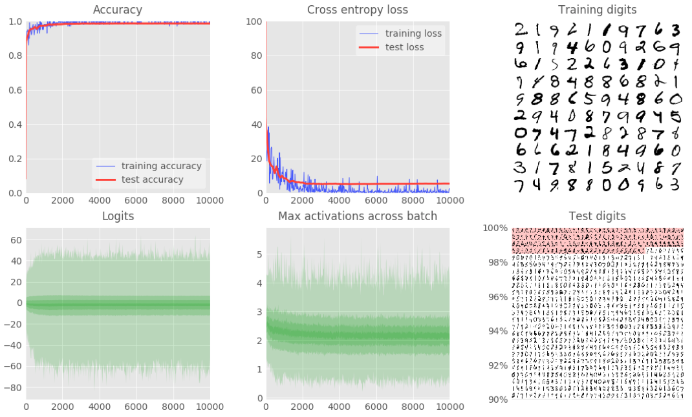
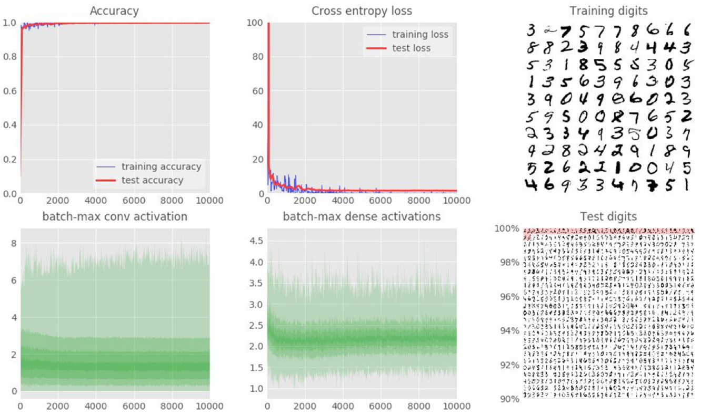

# Распознавание рукописных цифр из набора данных MNIST с помощью библиотеки TensorFlow

Установка:

```bash
git clone git@github.com:martin-gorner/tensorflow-mnist-tutorial.git
```

pip requirements:

```text
tensorflow==1.0.0
```

Архитектура первой сети:

```text
 neural network with 5 layers

 · · · · · · · · · ·       (input data, flattened pixels)       X [batch, 784]   # 784 = 28*28
 \x/x\x/x\x/x\x/x\x/    -- fully connected layer (relu+BN)      W1 [784, 200]      B1[200]
  · · · · · · · · ·                                             Y1 [batch, 200]
   \x/x\x/x\x/x\x/      -- fully connected layer (relu+BN)      W2 [200, 100]      B2[100]
    · · · · · · ·                                               Y2 [batch, 100]
    \x/x\x/x\x/         -- fully connected layer (relu+BN)      W3 [100, 60]       B3[60]
     · · · · ·                                                  Y3 [batch, 60]
     \x/x\x/            -- fully connected layer (relu+BN)      W4 [60, 30]        B4[30]
      · · ·                                                     Y4 [batch, 30]
      \x/               -- fully connected layer (softmax)      W5 [30, 10]        B5[10]
       ·                                                        Y5 [batch, 10]
```

Запуск:

```bash
python tensorflow-mnist-tutorial/mnist_4.1_batchnorm_five_layers_relu.py
```

Точность:



```text
max test accuracy: 0.9846
```

Архитектура второй сети:

```text
 · · · · · · · · · ·      (input data, 1-deep)                    X [batch, 28, 28, 1]
 @ @ @ @ @ @ @ @ @ @   -- conv. layer +BN 6x6x1=>24 stride 1      W1 [5, 5, 1, 24]        B1 [24]
 ∶∶∶∶∶∶∶∶∶∶∶∶∶∶∶∶∶∶∶                                              Y1 [batch, 28, 28, 6]
   @ @ @ @ @ @ @ @     -- conv. layer +BN 5x5x6=>48 stride 2      W2 [5, 5, 6, 48]        B2 [48]
   ∶∶∶∶∶∶∶∶∶∶∶∶∶∶∶                                                Y2 [batch, 14, 14, 12]
     @ @ @ @ @ @       -- conv. layer +BN 4x4x12=>64 stride 2     W3 [4, 4, 12, 64]       B3 [64]
     ∶∶∶∶∶∶∶∶∶∶∶                                                  Y3 [batch, 7, 7, 24] => reshaped to YY [batch, 7*7*24]
      \x/x\x\x/ ✞      -- fully connected layer (relu+dropout+BN) W4 [7*7*24, 200]       B4 [200]
       · · · ·                                                    Y4 [batch, 200]
       \x/x\x/         -- fully connected layer (softmax)         W5 [200, 10]           B5 [10]
        · · ·                                                     Y [batch, 20]
```

Запуск:

```bash
python tensorflow-mnist-tutorial/mnist_4.1_batchnorm_convolutional.py
```

Точность:




```text
max test accuracy: 0.9958
```

Выводы:

Проведено обучение глубокой нейронной сети и свёрточной нейронной сети. Сохранены их модели и веса.
