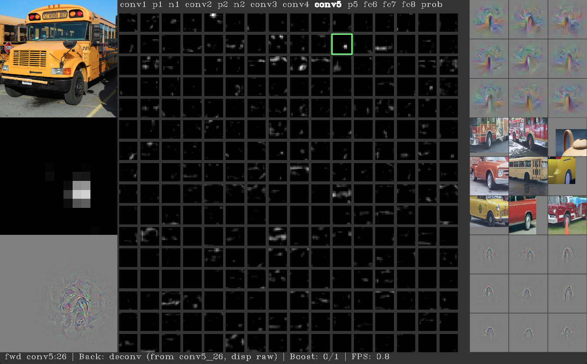

# Deep Visualisation Toolbox


Работа выполняется в операционной системе Ubuntu 16.04.

Также в работе используется Python 2.7 и библиотека компьютерного зрения OpenCV 3.1.0, 
установленная в виртуальное пространство.

Далее необходимо установить и скомпилировать Caffe – библиотеку, содержащую основные методы 
машинного обучения.

Предварительно нужно убедиться, что в системе не установлена Anaconda, т.к. в ином случае 
Caffe не может определиться, к какому python’у стоит обращаться.

Для установки Caffe предварительно необходимо установить некоторые библиотеки:
```bash
sudo apt-get install libprotobuf-dev libleveldb-dev libsnappy-dev libopencv-dev libboost-all-dev libhdf5-serial-dev libgflags-dev libgoogle-glog-dev liblmdb-dev protobuf-compiler
sudo apt-get install python-opencv python-scipy python-skimage
```

Затем нужно скачать Caffe с репозитория и сделать копию файла `Makefile.config.example`:
```bash
git clone https://github.com/BVLC/caffe
cd caffe
cp Makefile.config.example Makefile.config
```

Далее необходимо установить один пайтоновский пакет:
```bash
sudo pip install scikit-image protobuf
cd python
for req in $(cat requirements.txt); do sudo pip install $req; done
```

Затем необходимо внести изменения в файл `Makefile.config`, который находится в директории Caffe. 
Строчки, описанные ниже, должны быть такими же и в файле:
```bash
cd ..
sudo vim Makefile.config
```
```
# CPU-only switch (uncomment to build without GPU support).
CPU_ONLY := 1
...
# Uncomment if you're using OpenCV 3
OPENCV_VERSION := 3
...
PYTHON_INCLUDE := /usr/include/python2.7 \
/usr/local/lib/python2.7/dist-packages/numpy/core/include
…
INCLUDE_DIRS := $(PYTHON_INCLUDE) /usr/local/include /usr/include/hdf5/serial/ and
LIBRARY_DIRS := $(PYTHON_LIB) /usr/local/lib /usr/lib /usr/lib/x86_64-linux-gnu/hdf5/serial/
…
# ANACONDA_HOME := $(HOME)/anaconda2
...
# PYTHON_LIB := $(ANACONDA_HOME)/lib
```

Также во избежание ошибок стоит добавить ссылки на следующие файлы:
```bash
cd /usr/lib/x86_64-linux-gnu/
sudo ln -s /usr/lib/x86_64-linux-gnu/libhdf5_serial.so.10.1.0 /usr/lib/x86_64-linux-gnu/libhdf5.so
sudo ln -s /usr/lib/x86_64-linux-gnu/libhdf5_serial_hl.so.10.0.2 /usr/lib/x86_64-linux-gnu/libhdf5_hl.so
```
Затем нужно перейти в директорию Caffe и скомплировать библиотеку и протестировать её. Всё должно пройти успешно:
```bash
make all
make test
make runtest
```

Далее можно приступить к компиляции пайтоновской библиотеки Caffe:
```bash
make pycaffe
```
 
После проделывания всего выше описанного необходимо в конце файла bashrc добавить путь к пайтону:
```bash
sudo vim ~/.bashrc
export PYTHONPATH=$HOME/Downloads/caffe/python:$PYTHONPATH
```

Затем можно приступать к непосредственной работе с тулбоксом. Для начала необходимо в Caffe 
скомпилировать ветку для тулбокса. Для этого из директории Caffe нужно выполнить следующие 
команды:
```bash
git remote add yosinski https://github.com/yosinski/caffe.git
git fetch --all
git checkout --track -b deconv-deep-vis-toolbox yosinski/deconv-deep-vis-toolbox
make clean
make -j
make -j pycaffe
```

Далее нужно скачать исходники тулбокса и внести в файл settings_local.py такие коррективы, 
как путь к Caffe и возможность работы через CPU:
```bash
git clone https://github.com/yosinski/deep-visualization-toolbox
cd deep-visualization-toolbox
cp models/caffenet-yos/settings_local.template-caffenet-yos.py settings_local.py
```

Затем скачивается веса для модели:
```bash
cd models/caffenet-yos/
$ ./fetch.sh
$ cd ../..
```

И запускается тулбокс командой ./run_toolbox.py.

Входными данными для нейронной сети в режиме CPU является статичное изображение. Пользователь может загрузить любое 
своё изображение в папку input_images.

При использовании графического процессора, на вход подается поток видео с web-камеры (при ее наличии). 
В нашем случае используется вычислительная мощность процессора.

Для работы тулбокса используется четырнадцатислойная свёрточная нейронная сеть. Слои данной сети делятся на:

* conv1, conv2, conv3, conv4, conv5 — свёрточные слои.
* p1, p2, p5 — слои пулинга
* n1, n2 — слои нормализации
* fc6, fc7, fc8 — полносвязные слои

Для проверки работы было загружено собственное изображение:



Исходя из результатов, можно отметить, что нейронная сеть работает корректно.

*Выводы*

В результате проделанной работы были освоены сверточные сети. 
Наглядно изучены слои нейронных сетей и то каким образом нейронная сеть строит 
свои предположения.

